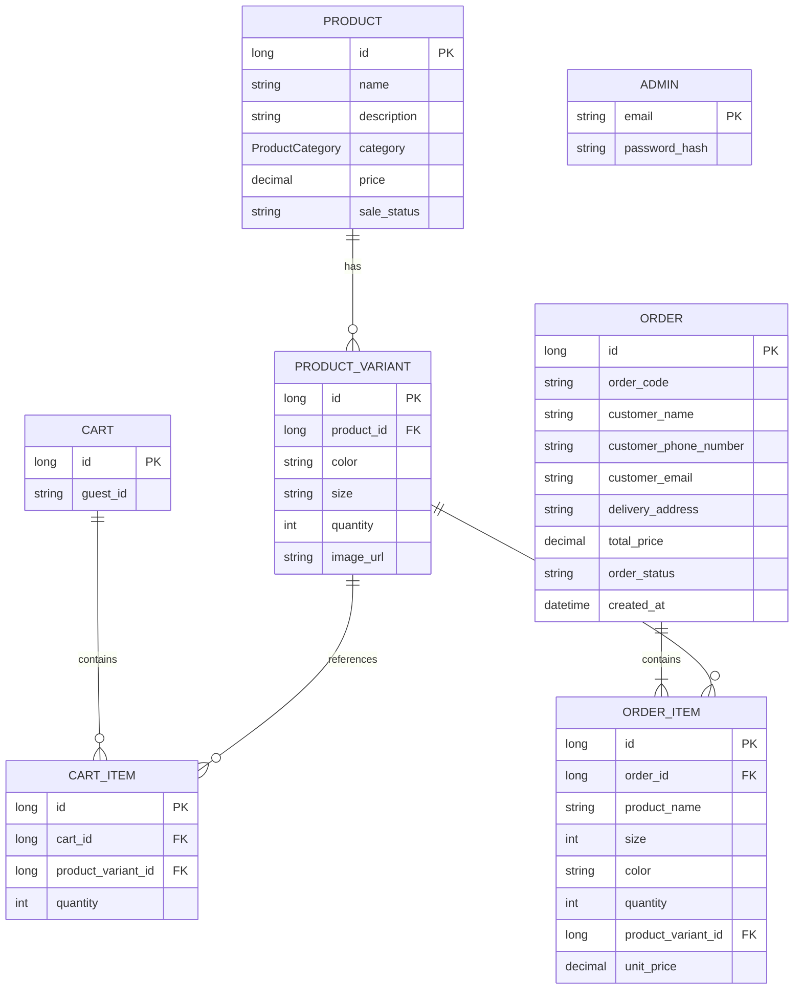

## Entity Relationship Diagram

```mermaid  
erDiagram  
    PRODUCT ||--o{ PRODUCT_VARIANT : has    CART ||--o{ CART_ITEM : contains    PRODUCT_VARIANT ||--o{ CART_ITEM : references    ORDER ||--|{ ORDER_ITEM : contains    PRODUCT_VARIANT ||--o{ ORDER_ITEM : references  
    PRODUCT {        long id PK        string name        string description        ProductCategory category        decimal price        string sale_status    }  
    PRODUCT_VARIANT {        long id PK        long product_id FK        string color        string size        int quantity        string image_url    }  
    ORDER {        long id PK        string order_code        string customer_name        string customer_phone_number        string customer_email        string delivery_address        decimal total_price        string order_status        datetime created_at    }  
    CART {        long id PK        string guest_id    }  
    CART_ITEM {        long id PK        long cart_id FK        long product_variant_id FK        int quantity    }  
    ORDER_ITEM {        long id PK        long order_id FK        string product_name        int size        string color        int quantity        long product_variant_id FK        decimal unit_price    }  
    ADMIN {        string email PK        string password_hash    }  
```