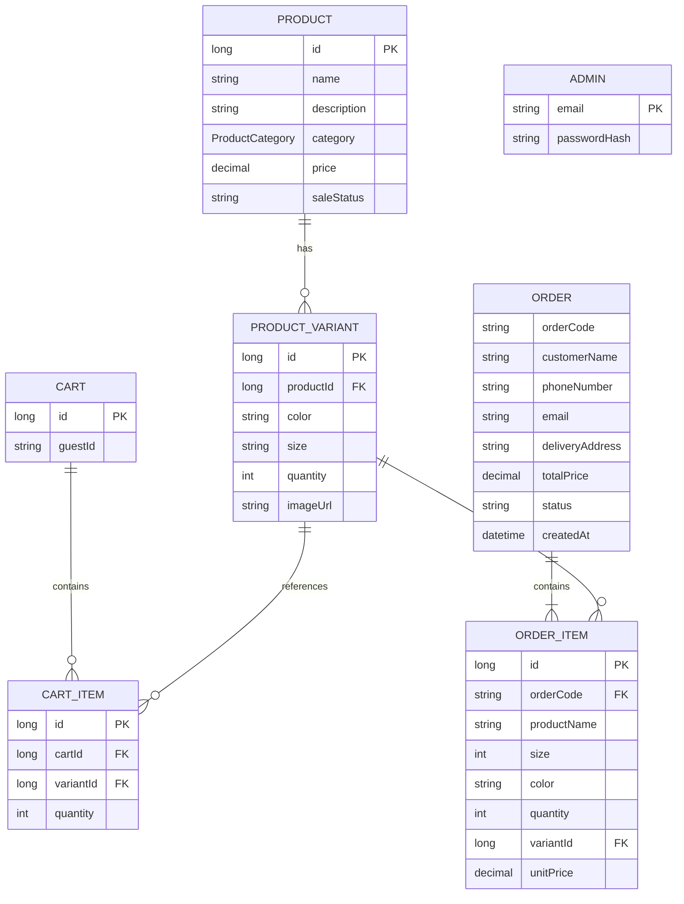

## Entity Relationship Diagram

```mermaid  
erDiagram  
    PRODUCT ||--o{ PRODUCT_VARIANT : has    CART ||--o{ CART_ITEM : contains    PRODUCT_VARIANT ||--o{ CART_ITEM : references    ORDER ||--|{ ORDER_ITEM : contains    PRODUCT_VARIANT ||--o{ ORDER_ITEM : references  
    PRODUCT {        long id PK        string name        string description        ProductCategory category        decimal price        string saleStatus    }  
    PRODUCT_VARIANT {        long id PK        long productId FK        string color        string size        int quantity        string imageUrl    }  
    ORDER {       string orderCode        string customerName        string phoneNumber        string email        string deliveryAddress        decimal totalPrice        string status        datetime createdAt    }  
    CART {        long id PK        string guestId    }  
    CART_ITEM {        long id PK        long cartId FK        long variantId FK        int quantity    }  
    ORDER_ITEM {        long id PK        string orderCode FK        string productName        int size        string color        int quantity        long variantId FK        decimal unitPrice    }  
    ADMIN {        string email PK        string passwordHash    }  
```